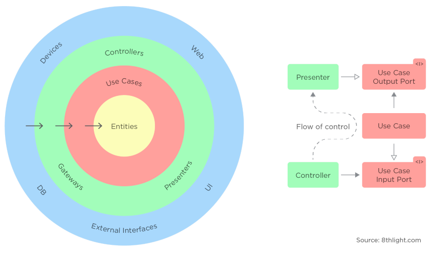
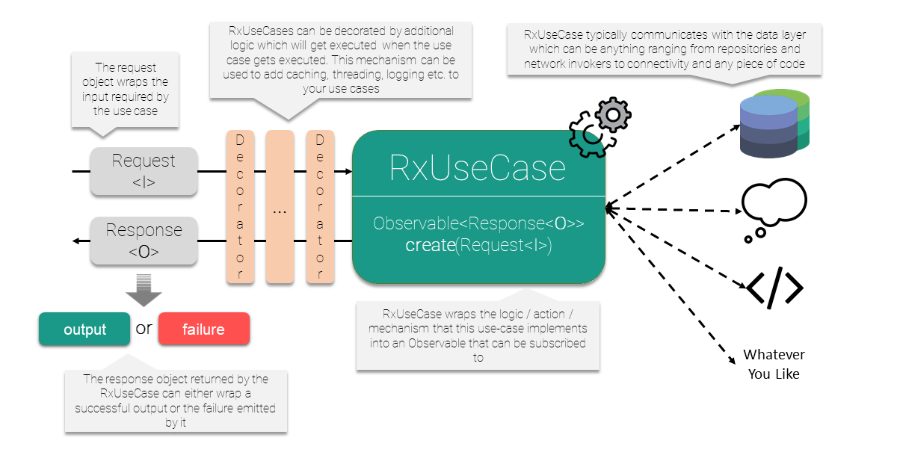
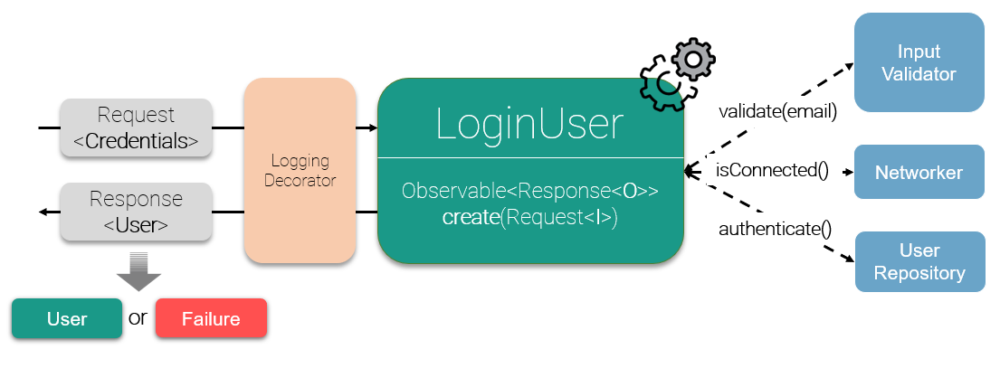

[  ](https://bintray.com/rrdev/RxUseCase/digital.bakehouse.rxusecase/_latestVersion)[](https://opensource.org/licenses/MIT) [](https://img.shields.io/travis/bakehousedigital/rxusecase/master.svg)

# RxUseCase

RxUseCase is a tiny Java library for wrapping business logic into reactive streams which expose data in a standardized way.

The library provides the core components for implementing the Use Cases (also known as Interactors) of  
[Uncle Bob's Clean Architecture](https://blog.cleancoder.com/uncle-bob/2012/08/13/the-clean-architecture.html) approach, which orchestrate the flow of data to and from the entities and represent the essence of a typical domain layer. 
<br/>
<p align="center">
  
</p>

## Download

### Gradle

```groovy
implementation 'digital.bakehouse:rxusecase:0.9.5'
```

### Maven
```xml
<dependency>
	<groupId>digital.bakehouse</groupId>
	<artifactId>rxusecase</artifactId>
	<version>0.9.5</version>
	<type>pom</type>
</dependency>
```

## How it works
<p align="center">
  
</p>

<br/>

**RxUseCase** wraps the logic / action / mechanism that the use-case implements, into an Observable that can be subscribed to. 
It can act as an interactor, communicating to with internal or external components or systems for:
* validating data, current state or context
* retrieving or setting data, local or remote
* subscribing to continuous data changes
* doing any sort of operations, long or short running, one-shot or continously emitting

It should be thought of as a self-contained operation with single contextual responsibility. 

<br/>

**RxUseCase** has a standard interface of passing and getting data. It:
* operates with the **Request** parameter, which wraps the input required by the use-case
* emits a **Response** object which encapsulates either a successful output or the failure returned by the use-case

This enables another way of describing use-cases as entities which act as a standard input - standard output proxies to the outside world.

<br/>

<p align="center">
  
</p>

<br/>

**Example: Login Use-Case**

Let's take for example a simple login use-case. The typical requirement of such a use-case is to:
* first validate the user's email
* then check the internet connection
* and only in case the email is valid, and there is internet connection - to call the server API for authentication. 

Additionally, as developers we would like to log the input, output and the execution time of the use-case.

<br/>

Using **RxUseCase** this can be modelled as described below.
```java
    class LoginUser extends RxUseCase<Credentials, User> {

        private static final String VALIDATION_ERROR = "0";
        private static final String NETWORK_ERROR = "1";
        private static final String LOGIN_ERROR = "2";
        private InputValidator validator;
        private Networker networker;
        private UserRepository userRepository;

        public LoginUser(InputValidator validator, Networker networker, UserRepository userRepository) {
            this.validator = validator;
            this.networker = networker;
            this.userRepository = userRepository;
        }

        @Override
        protected Observable<Response<User>> execute(Credentials input) {
            boolean isEmailValid = validator.validateEmail(input.getEmail());
            if (!isEmailValid) {
                return justFail(VALIDATION_ERROR, "The email is not valid!");
            }

            if (!networker.isConnected()) {
                return justFail(NETWORK_ERROR, "There is no connection to the internet!");
            }

            return userRepository.authenticate(input.getEmail(), input.getPassword())
                    .map(Response::succeed)
                    .onErrorReturnItem(Response.fail(LOGIN_ERROR, "Invalid credentials"));
        }
    }
```
<br/>

And the usage would look similar to the following:

```java
        LoginUser loginUser = new LoginUser(validator, networker, userRepository);
        loginUser
                .decorateWith(LogDecorator.getDefault())
                .create(new Credentials("user@test.com", "qwerty"))
                .subscribe(new ResponseConsumer<>(
                        user -> //do things with the user
                        failure -> //do things with failure
                ));
```

<br/>

The diagram from above mapped to this use-case looks like this:

<br/>

<p align="center">
  
</p>

<br/>


## Usage
To be added, but for now please check

* Extending RxUseCase, SynchronousUseCase, AsynchronousUseCase, ContinuousUseCase
* Wrapping using RxUseCase .wrap methods
* Consuming RxUseCases with ResponseConsumers
* Decorating RxUseCases with UseCaseDecorators

## Contributing
Pull requests are welcome. For major changes, please open an issue first to discuss what you would like to change.

Please make sure to update tests as appropriate.

## License
[MIT](https://github.com/bakehousedigital/rxusecase/blob/master/LICENSE)
